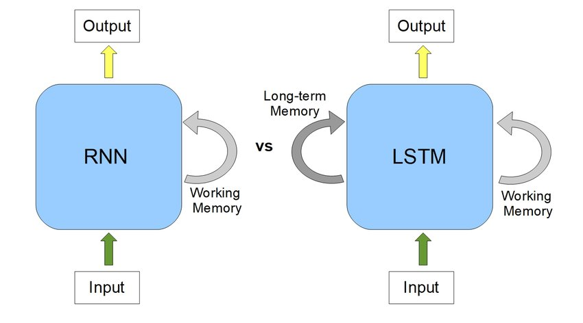

# Sentiment Analysis Using LSTM

This project demonstrates the application of a Long Short-Term Memory (LSTM) neural network to perform sentiment analysis on movie reviews. It uses Keras and TensorFlow to create and train an LSTM model to classify reviews as positive, negative, or neutral based on their content.

## Sentiment Classification
Sentiment classification automates the task of detecting and categorizing emotions in text into positive, negative, or neutral categories, based on the expressed opinions. This process, which leverages Natural Language Processing (NLP), is crucial for understanding customer perceptions and emotions about your brand, products, and services.

Manually sifting through and categorizing textual data is time-consuming and can distract from capturing key insights due to the tedious nature of manual analysis of positive and negative sentiments.

In recent years, sentiment classification has experienced significant growth and adoption across various industries. Many companies now rely on this technology to gain deeper insights into their customers’ emotions, behaviors, preferences, and needs.

Automated classification techniques allow for quicker analysis of reviews, comments, survey responses, and other forms of public feedback. These methods efficiently assess the general sentiment towards your brand and products, providing valuable insights into broader industry trends and market dynamics.

## Recurrent Neural Network (RNN)
A recurrent neural network (RNN) is particularly effective with sequential data, making it well-suited for processing text, which inherently consists of word sequences. In this context, we'll employ an LSTM (Long Short-Term Memory) network, a specialized form of RNN, to tackle a sentiment classification challenge using movie reviews.

An LSTM unit is composed of a cell and three gates: an input gate, an output gate, and a forget gate. The cell is capable of maintaining information over extended periods, while the gates control the flow of information into and out of the cell, helping manage memory in the network.

LSTM networks are ideal for handling classification tasks involving time series data and are adept at overcoming issues like exploding and vanishing gradients, which are common pitfalls in training conventional RNNs.

## Features

- **Data Preprocessing**: Converts raw text into a format suitable for the LSTM model.
- **Model Training**: Trains an LSTM model on preprocessed text data.
- **Sentiment Prediction**: Uses the trained model to predict the sentiment of new movie reviews.
- **Model Evaluation**: Assesses the accuracy and effectiveness of the model on a test dataset.

## Installation

Clone this repository to your local machine using the following command:
git clone https://github.com/nandutejaswini/Sentiment-analysis.git

## Usage
Run the Jupyter notebook to see the step-by-step process of data preprocessing, model building, training, and evaluation:

jupyter notebook Sentiment_Analysis_using_LSTM_Model.ipynb

## Model Architecture
The LSTM model used in this project includes:

An embedding layer that converts text inputs into dense vectors.
An LSTM layer with dropout to prevent overfitting.
A dense output layer with a sigmoid activation function to classify the input as positive or negative.
## Contributing
Contributions to this project are welcome. Please fork the repository and submit a pull request with your proposed changes. For major changes or new features, please open an issue first to discuss what you would like to add or change.

## License
This project is licensed under the MIT License - see the LICENSE.txt file for details.
